# Eindopdracht - Interactieve vuurwerkshow

In deze vak had ik de kans gekregen om los te gaan met CSS. Ik ging CSS technieken onderzoeken die ik nooit had gebruikt en daarmee een interactieve vuurwerk showcase maken. De naam zeg het al. Mijn project is een slideshow met verschillende vuurwerkshows waar je kan zelf bedienen. In elke slide is er een CSS techniek die ik had onderzocht en in de show geimplemnteerd. Voor neer gedetailleerde beschrijvingen over mijn project kan u naar me [wiki](https://github.com/K3A101/css-to-the-rescue-2223/wiki) gaan. 

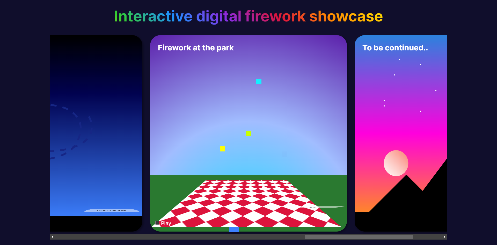
---
# Het proces

- [Week 1](https://github.com/K3A101/css-to-the-rescue-2223#week-1---planning)
- [Week 2](https://github.com/K3A101/css-to-the-rescue-2223#week-2)
- [Week 3](https://github.com/K3A101/css-to-the-rescue-2223#week-3)
- [Week 4](https://github.com/K3A101/css-to-the-rescue-2223#week-4)
---


## Week 1 - Planning
De opdracht die ik ga kiezen is de Interactieve vuurwerkshow.

De CSS technieken die ik ga gebruiken zijn:
- Prefer-color-scheme
- Prefer reduced motion
- Gradients 
- Motion path 
- 3D Transforms en animatie

### Code uitdagingen:
- Ik moet proberen om uit mijn comfortzone te gaan. Ik heb de neiging om dingen niet te probren die ik niet kan begrijpen of kan. Moet deze keer wel gaan doen.
- Ik heb moeite om specifiek berekening te gebruiken in css, bijvoorbeeld met calc(). Ook heb ik moeite met de waardes van bijvoorbeeld box-shadows etc.


## Eerste schetsen
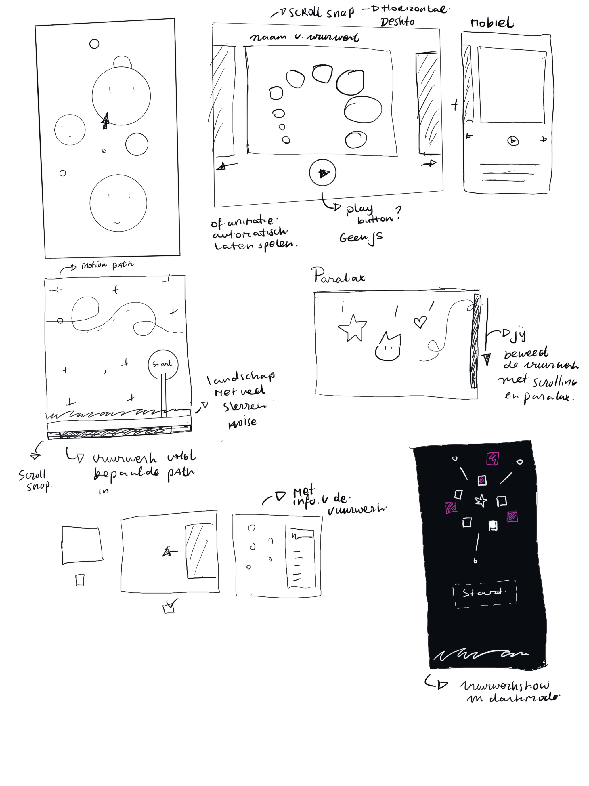

### Toelichting
Hier heb ik een aantal ideeen voor mijn opdracht geschets.
Ik heb technieken van css toegevoegd die ik kan implementeren in mijn project.

CSS technieken zoals:
- Scroll-snap
- prefer color scheme
- Paralax
- 3D Transform
- Motion path met svg
- Interactie met :has selector
- Gradients


### Planning
- Inspiratie zoeken van andere werken
- Inspiratie beelden verzamelen
- Schetsen maken van mogelijke ideeen
- Ideen kiezen en breakdownschets maken
- Eerste stukje proberen te coderen


# Voortgang 1
Stapje van de versie 
Idee  vakjes met verschillende vuurwerken, dus met animatie en de vakken swipen met scroll-snap. En andere css technieken proberen

## Planning na voortgang 1
- CSS technieken onderzoeken en toepassen
- De layout van de pagina klaar hebben 
- Themassesie onderwerpen toepassen

---
# Week 2
Na de eerste voortganggesprek heb ik meer onderzoek gedaan aan verschillende css technieken die ik kan gebruiken voor mij vuurwerk showcase. Alleen ik moest nog leren hoe ze werken. Dus ik probeer bij elke vakje, een css techniek toepassen en elke keer opbouwen als ik nieuwe dingen leert. 

Wat ik heb geleerd waren:
- 3D CSS Animatie
- De werking van CSS gradients.
- Geanimeerde pixels
- Werken met :has() selectors


### Eerste CSS Animatie 
Om animatie in css te maken, gebruiken we `@keyframes`. Zoals bij animaties programmas bepaal je aantal keyframes en je zeg het wat moet 
gebeuren. 

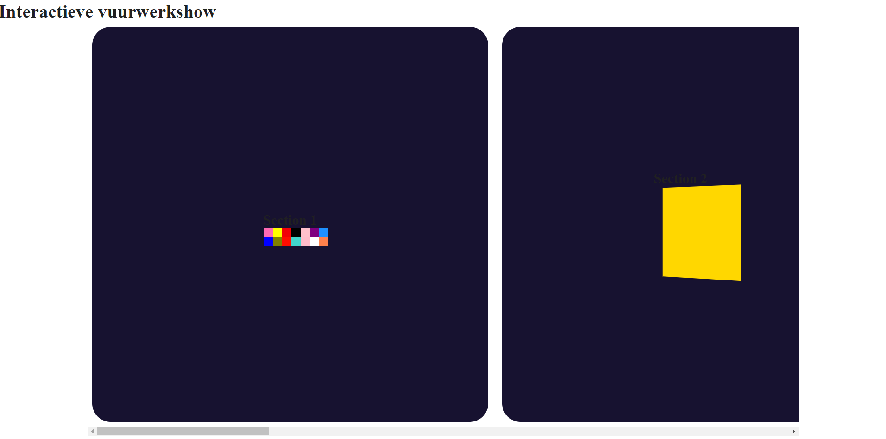
Hier ben ik begonnen met ik begonnen met de eerste tween animaties voor mijn interactieve vuurwerkshows. Het zijn animatie die ik heb geleerd tijdens de thema sessie van Sanne. 

Bij de eerste section heb ik een soort van pixel animatie maken met behulp van box-shadows. Daarna probeer ik de box-shadow te animeren met @keyframes. 

Bij de tweede section heb ik de vierkant op een 3D ruimte gedraaid. Ik heb de property `transform-style: preserve-3d` gebruikt bij. Dus wanneer ik de `transform` property gebruikt het gebeurd het allemaal in een driedimensionale ruimte. Dus bij de tweede section heb je een flip effect met de rotate bij de X-Axis.


### 3D transform
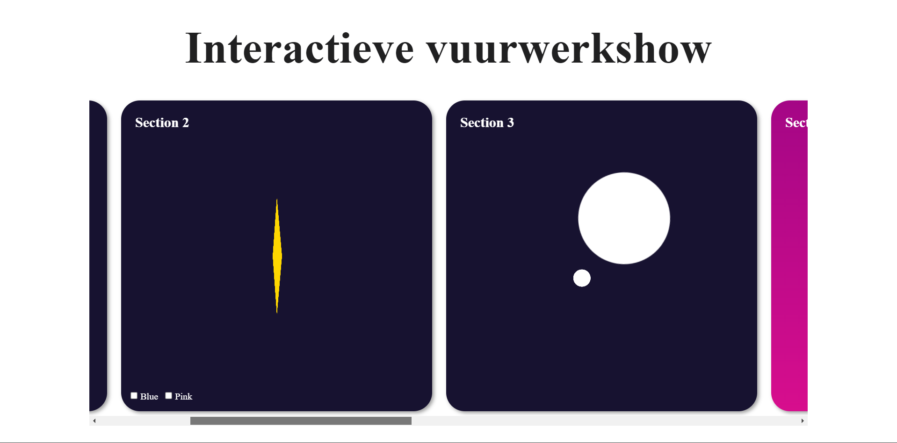

Verder heb ik een beetje gespeeld met 3D Animatie. Ik heb verschillende properties geprobeerd, zoals  `perspective`, `transform-style: preserver-3d` en `transform-origin`. 

Ik wil het een beetje interactief maken dat en ik heb de :has() selector gebruikt.


# Voortgang 2
ALs feedback heb ik gekregen dat ik meer context kan toevoegen, zodat iemand anders kan weten wat voor van vuurwerk het is. 

## Planning
- De layout interactiever te maken, door de vakjes te flippen en zie je aan de achterkant een korte beschrijving
- Motion path animaties toevoegen
- CSS Gradients toevoegen
- Korte beschrijving onderaan met vuurwerkshow uitleg
- Ander lettertype zoeken. 

---
# Week 3

## Wat heb ik gedaan.

Gedaan:
- Geëxperimenteerd met motion path
- Opstapelende geanimeerde Gradients
- interactie tovoegen
- Inter lettertype gebruikt voor het project
- Ervoor zorgen dat de animatie speelt waanneer de checkbox aangevinkt is. 

### Gradients
In de volgende vakjes van mijn vuurwerk showcase ging ik meer experimenteren met gradients. Ook heb ik de gradients geanimeerd en verschillende nieuwe dingen geleerd. Eerst heb ik een onderzoek gedaan over gradients in css om de samenstelling  van de properties beter te begrijpen en daarna in de schowcase te implementeren. Verder heb ik ook de workshop over gradients deelgenomen om meer gericht kennis krijgen. 

Hieronder zijn verschillende experimenten die ik heb geprobeerd:

#### 6 gradients
- `Linear-gradient()`
- `radial-gradient()`
- `conic-gradient()`
- `repeating-linear-gradient()`
- `repeating-radial-gradient()`
- `repeating-conic-gradient()`

Om de gradients te animeren kan ik de position en de size animeren. 

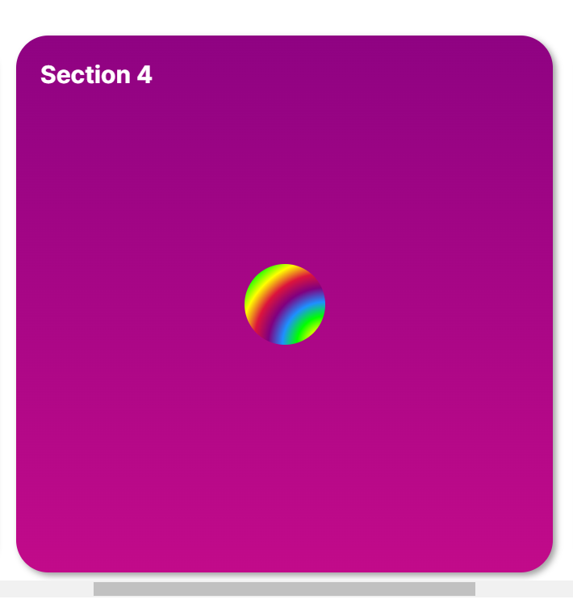
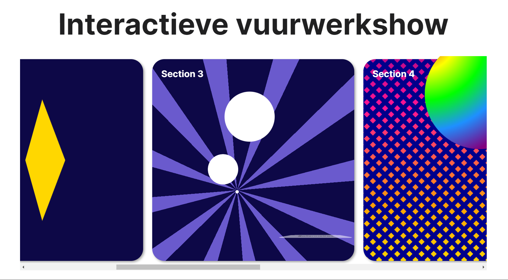
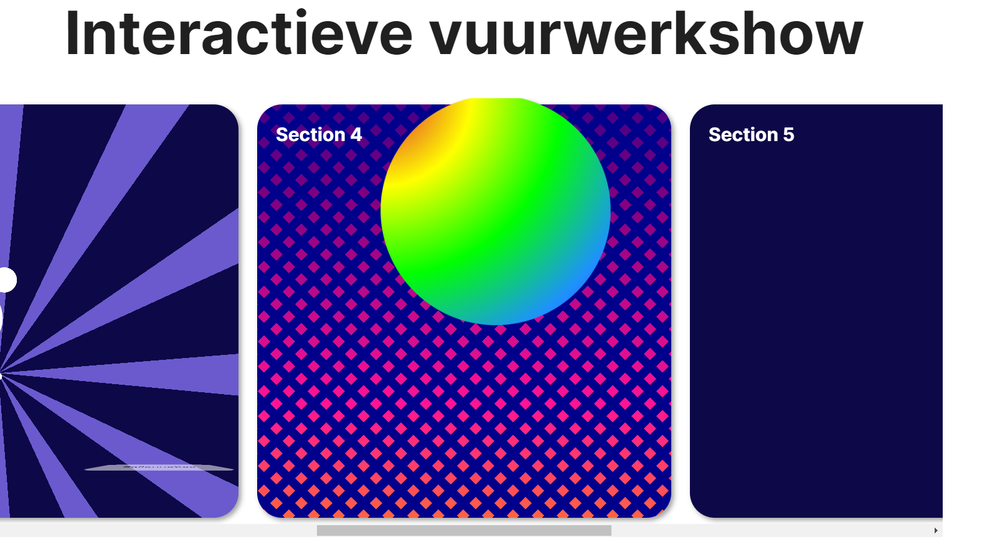
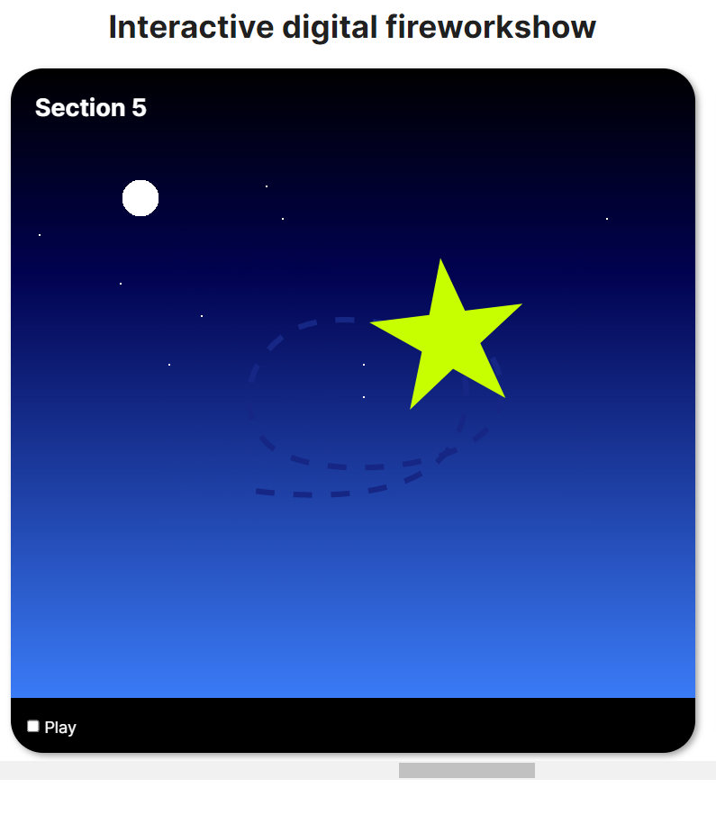


---

### Motion-path
De volgende trucje voor mijn slideshow was dat ik iets met motion path zou doen. Dit was een uitdaging meaar is wel uiteindelijk gelukt.  Ik heb eerst in illustrator de lijn getekend, en daarna in de code geplaats in een svg eleemnt. Wat ik wilde doen was de ster de path van de lijn volgen. m dat te bereiken heb ik de property `offset-path: path()` gebruikt bij de ster. Om de ster te maken heb ik de de `clip-path: polygoon()` property gebruikt. D path van de lijne heb ik in de offset-path gezet en de ster laten animeren met offset-distance. Van 0% tot 100%. Dus de ster beweegt van 

#### De code 
```html

   <figure class="stars"> </figure>
<svg id="Layer_2" xmlns="http://www.w3.org/2000/svg" viewBox="0 0 325.85 202.29">
      <path class="cls-1"  d="m59.22,186.26c56.79,7.03,178.43,13.28,213.4-55.31,46.12-90.47-45.28-117.08-45.28-117.08,0,0-94.27-28.97-140.4,7.69-46.12,36.66-41.83,84.43-17.74,111.76,39.62,44.94,224.65,36.26,249.46-31.34,9.05-24.66,1.72-45.73-6.19-59.22"> </path>         </svg>
               

```


```css
/* Hier volg de ster  de path van de lijn  */

section:nth-of-type(5) div figure {
    z-index: 1;
    position: absolute;
    top: 0;

    clip-path: polygon(50% 0%, 61% 35%, 98% 35%, 68% 57%, 79% 91%, 50% 70%, 21% 91%, 32% 57%, 2% 35%, 39% 35%);
    width: 10em;
    height: 10em;
    background-color: #c8ff00;

  /* De path van de lijn  */
    offset-path: path("m59.22,186.26c56.79,7.03,178.43,13.28,213.4-55.31,46.12-90.47-45.28-117.08-45.28-117.08,0,0-94.27-28.97-140.4,7.69-46.12,36.66-41.83,84.43-17.74,111.76,39.62,44.94,224.65,36.26,249.46-31.34,9.05-24.66,1.72-45.73-6.19-59.22");
    /* offset-rotate: auto; */
    animation: follow-path 4s linear alternate infinite;
}


@keyframes follow-path {
    0% {
        offset-distance: 0%;
    }

    100% {

        offset-distance: 100%;
    }
}

```


--- 
# Meer interactie
Als laatste heb ik meer interactie toegevoegd in mijn slideshow. Ik heb het zo gedaan dat je met de check box de animatie laten spelen en pauseren. Dit waren allemaal mogelijk met de has selector. 


--- 
# Voortgang 3

In de derde voortgang heb ik mijn voortgang besproken. Ik heb nieuwe verandering aan het groep gepresenteerd.
- nieuwe gradient trucjes
- De opstapelede box-shadows
- Motion path
- Nieuwe vorm van interactie

## Feedback van  voortgang 3

- Uitkijken voor mensen met epilepsie
- Iets laten gebeuren als het reponsive is
- De rest van de vakje vullen met experimenten.

---
## Wat heb ik geleerd en gemaakt
 - De titel geanimeerd met een gradient effect
 - De achtergond van de pagina naar een donker blauw verandert
 - Heb ik de zesde vakje gevuld met animaties
 - Ik had de color scheme gezet naar donker.


 ### Andere achtergrond
 De donkere achtergrond zorgt ervoor dat vakjes meer opvallender zijn. Hiermee kan meer focussen op de vuurwerkshow. 

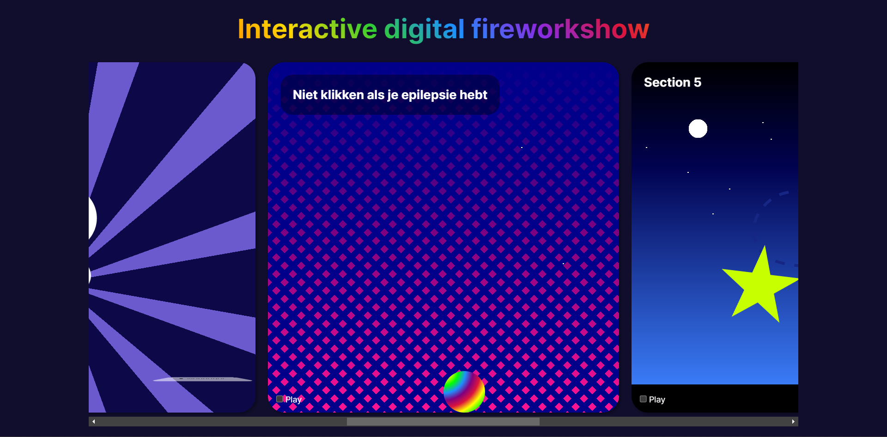

### Vuurwerk in de Park
Ik heb de zesde vakje gevuld met een andere animatie. Het landschap gemaakt met gradients en een picnic tapijt, dus jij (de kijker), zit je vuurwerk te kijken in de park.
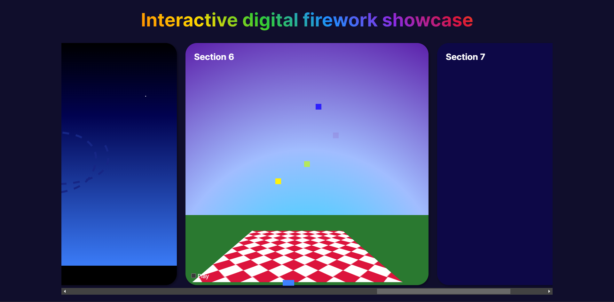

#### Wat heb ik gebruikt:
- `radial-gradient()`
-  `linear-gradient()`
- `conic-gradient()`
- `box-shadows`

Bij deze link krijg je het uitgebreide code te zien:
- [Vuurwerk in de park code](https://github.com/K3A101/css-to-the-rescue-2223/wiki/animaties#vuurwerk-in-de-park)

---
## Soort van responsive
Verder heb ik de showcase responsive gemaakt door de vakjes onder elkaar te zetten bij kleinere scheremen. Het is niet niet helemaal perfect maar alle animaties zijn te zien. Maar mijn focus ligt aan de desktop versie.

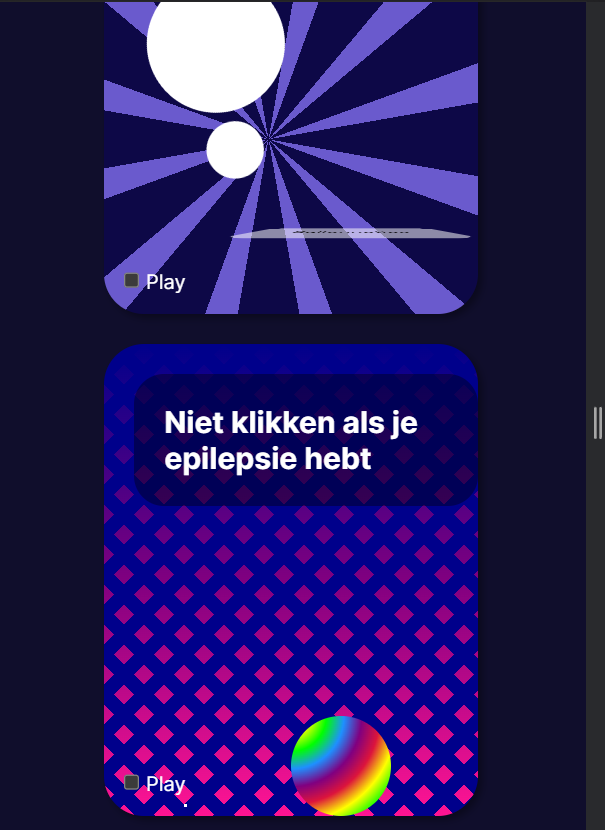

---
# Week 4 
Dit is de laatste week voor de beeordelingsgesprek. In deze week heb ik  gefocust op de details en puntjes op de i.

## Wat ik heb gedaan
- De laatste vakje gevuld met animatie
- Een beschrijving per vuurwerkshow
- Code opschonen
- Readme Updaten met nieuwe informatie
- Betere beschrijving geven aan elke slide

---

### Laatste show: Vuurwerk achter de berg
De laatste vuurwerkshow is een combinatie van alle CSS technieken die ik de laatste vier weken had geleerd. Ik hebe gebruikt gemaakt van gradients, 3D transforms en box-shadows. Wat je ziet is vuurwerkshow die plaatsneem achter de bergen. 

De onderdelen:
- De landschap die bestaat uit twee linear gradients, een voor de lucht en de andere voor de grond.
- De bergen,  zijn driekhoeken gevormd door  clip-paths
- De sterrebn gemaakt met kleine witte box-shadows
- De vuurwerk zelf zijn de 3D transform animatie

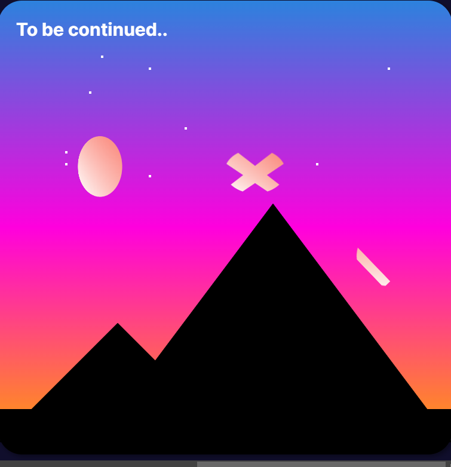

[Hier is de code](https://github.com/K3A101/css-to-the-rescue-2223/wiki/Week4#hier-is-de-code-voor-het-maken-van-deze-onderdeel)


### Achtergrond van de body verandert met een button
Voor de hele slideshow, heb ik gebruikt gemaakt van de attribute `:checked` bij checkboxes om iets laten gebeuren. Maar het is me wel gelukt om button te gebruiken in plaats van een checkbox. Voor mij is het nuttig want dan hoef ik geen eventlistener van javascript te gebruiken om iets te laten gebeuren met een knop. 

Wat ik heb gedaan met deze button is dat als je erop klikt, dan verandert de achtergrond van de body naar wit en elke slide krijgt een knipperende rand die 5 seconde duurt. Verder de achtergrond van elke onderdeel wordt een lichtere blauw. 

Om de verandering toe te passen heb ik de de `has()` selector gebruikt. Hieronder kun je de code bekijken hiervoor'

#### De code
```html
 <header>
        <h1>Interactive digital firework showcase </h1>
        <label for="change-modus" id="modus-btn">Change Modus</label>
        <input type="checkbox" id="change-modus">
    </header>

```

```css
:has(#change-modus:checked) body {
   background-color: white;
    color-scheme: light;
}

:has(#change-modus:checked) section {
background-color: #2a2c8b;
box-shadow: 0em 0em .5em .2em salmon;
animation: knipperend 1s 5;
}

```

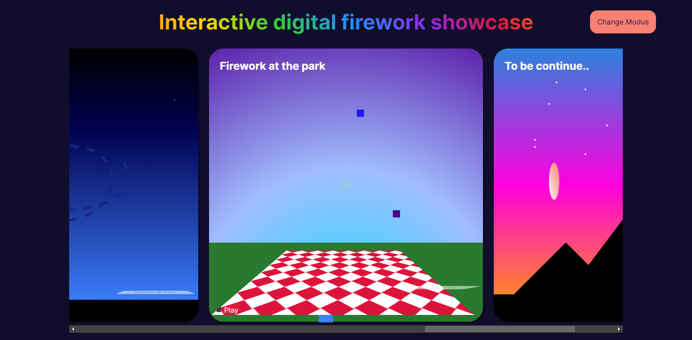
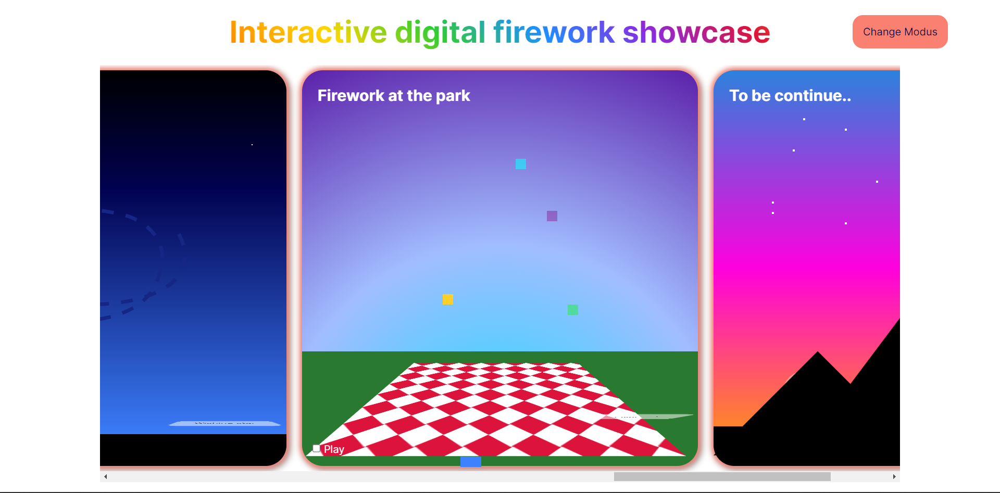


---
# Reflectie

## Wat heb ik allemaal geleerd?
Ik heb veel geleerd de laatste vier weken. Ik ben van iemad die onzeker was over mijn project naar iemand die zich veel nieuwe CSS technieken kent. Hieronder staan een lijstje van wat ik allemaal had geleerd.

### CSS technieken
- [x] 3D Animatie met transform
- [x] 3D Transform 
- [x] Scroll snap
- [x] has() selectors
- [x] Het animeren van gradients
- [x] Pixel kunstwerken
- [X] Animeren van box-shadows
- [x] Motion path

## Wat zou ik anders doen?
Als ik meer tijd had zou ik iets met `prefer-color-scheme` en `prefer-reduce-motion` doen.

### Licht en donker modus
Met de prefer-color-scheme zou ik een dark modus en licht modus implemeteren met de has selector. Dus wat je nu ziet zou de darkmode zijn. Maar als iemand licht modus heeft dan krijg die een andere soort ontwerp. Elke slides krijg ook een andere kleur. 
 
### Minder animatie
Ik zou ook een stijling maken voor mensen die `prefer-rduce-motion` aan hebt. Dus een versie van minder animatie. 

### Echte vuurwerkjes
Met Echte vuurwerk bedoel ik dat, ervoor zorgen dat die eerst omhoog gaat en dan wanneer die omhoog is in verschillende kleuren spatten. Hier zou ik meer dan zetten naast elkaar. Ik heb een poging gedaan bij de voorlaatste onderdeel, alleen het was niet helemaal wat ik wilde. 

---

## Bronnen
- Animatable CSS properties - CSS: Cascading Style Sheets | MDN. (2023, 21 februari). https://developer.mozilla.org/en-US/docs/Web/CSS/CSS_animated_properties
- background-clip - CSS: Cascading Style Sheets | MDN. (2023, 21 februari). https://developer.mozilla.org/en-US/docs/Web/CSS/background-clip
- Coyier, C. (2018, 26 april). Radial Gradient Recipes | CSS-Tricks. CSS-Tricks. https://css-tricks.com/radial-gradient-recipes/
- Coyier, C. (2021, 26 januari). CSS Gradients | CSS-Tricks. CSS-Tricks. https://css-tricks.com/css3-gradients/
- cubic-bezier.com. (z.d.). https://cubic-bezier.com/#.17,.67,.83,.67
- Do you really understand CSS radial-gradients? - Patrick Brosset. (2022, 24 oktober). Patrick Brosset. https://patrickbrosset.com/articles/2022-10-24-do-you-really-understand-CSS-radial-gradients/
- Get Moving (or not) with CSS Motion Path. (z.d.). https://danielcwilson.com/blog/2020/01/motion-path-quirks/
- Matuzović, M. (2022, 3 oktober). Day 6: the :has() pseudo-class. Day 6: the :has() pseudo-class. https://www.matuzo.at/blog/2022/100daysof-day6/
- offset-path - CSS: Cascading Style Sheets | MDN. (2023, 21 februari). https://developer.mozilla.org/en-US/docs/Web/CSS/offset-path
- S. (z.d.-a). Alles tesaam voor de dames. https://www.sinds1971.nl/cssvoordedames/11-alles-tesaam.html
- S. (z.d.-b). Animations voor de dames. https://www.sinds1971.nl/cssvoordedames/8-animations.html
- Using CSS gradients - CSS: Cascading Style Sheets | MDN. (2023a, februari 21). https://developer.mozilla.org/en-US/docs/Web/CSS/CSS_Images/Using_CSS_gradients
- Using CSS gradients - CSS: Cascading Style Sheets | MDN. (2023b, februari 21). https://developer.mozilla.org/en-US/docs/Web/CSS/CSS_Images/Using_CSS_gradients